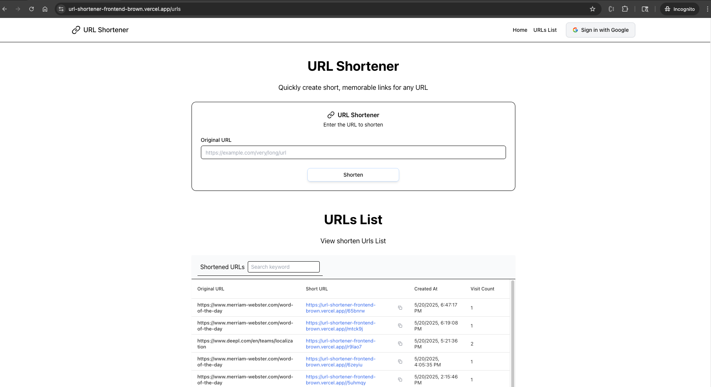

# URL Shortener Application

A full-stack URL shortener application built with Next.js, NestJS, and Supabase, designed with scalability in mind.


*Homepage of the URL Shortener application with URL input field and list of shortened URLs*

## Technology Stack

- **Frontend**: TypeScript, Next.js, shadcn UI components with Tailwind CSS
- **Backend**: TypeScript, NestJS, Node.js
- **Database**: Supabase (PostgreSQL) with Prisma ORM
- **Deployment**: Vercel (Frontend) and Render (Backend)

## Core Features

- Generate shortened URLs from long ones using nanoid for unique slug generation
- Redirect from short URLs to original destinations
- List all shortened URLs
- Track visit counts (implemented/planned)

## Architecture & Scalability Considerations

1. **Stateless Backend**: NestJS application designed without session state, enabling horizontal scaling across multiple instances.

2. **Database Selection**: Supabase (PostgreSQL) chosen for:
   - Reliability and ACID compliance
   - Managed service with automatic scaling
   - Strong support for complex queries and data integrity

3. **Slug Generation Strategy**: 
   - Using nanoid for short, unique identifiers (6-8 alphanumeric characters)
   - Implemented with collision detection and retry mechanism
   - Optimized for distributed environments

4. **Error Handling & Logging**:
   - Centralized error handling with NestJS exception filters
   - Structured JSON logging (via Pino) directed to stdout/stderr
   - Designed for easy diagnosis in distributed environments

5. **Caching Strategy**:
   - In-memory caching for redirection endpoints (implemented/planned)
   - Discussion of Redis as future enhancement for distributed caching

6. **API Design**:
   - RESTful principles with clear endpoint structure
   - DTOs with class-validator for input validation
   - Consistent JSON response format

## API Endpoints

- `POST /api/shorten`: Create shortened URL
- `GET /api/r/{shortSlug}`: Redirect to original URL
- `GET /api/urls`: List all shortened URLs

## Setup & Deployment

### Local Development

```bash
# Install dependencies
npm install
cd frontend && npm install
cd ../backend && npm install

# Set up environment variables (see below)

# Set up database
cd backend
npx prisma generate
npx prisma migrate dev

# Run development server
frontend: npm run dev
backend: npm run start:dev
```

Required environment variables:
- Backend (.env): DATABASE_URL, APP_DOMAIN
- Frontend (.env.local): NEXT_PUBLIC_API_URL

### Deployment

#### Frontend (Vercel)
1. Import GitHub repository in Vercel
2. Set root directory to `frontend`
3. Configure environment variables:
   - `NEXT_PUBLIC_API_URL`: URL of your deployed backend

#### Backend (Render)
1. Import GitHub repository in Render
2. Create a new Web Service (not serverless function)
3. Configure the service:
   - **Build Command**: `npm ci && npm run build`
   - **Start Command**: `npm run start:prod`
4. Set environment variables:
   - `DATABASE_URL`: Supabase connection string with connection pooling
   - `APP_DOMAIN`: Your frontend domain
   - `PORT`: 10000 (automatically set by Render)
   - `NODE_ENV`: production

## Future Enhancements

- **Distributed Caching**: Redis implementation for improved read performance
- **Rate Limiting**: Using @nestjs/throttler to prevent API abuse
- **Enhanced Analytics**: More detailed statistics for URL visits
- **Custom Slugs**: Allow users to define their own short URLs